프로필
============
## 김동혁 / DongHyuk Kim
#### Email&ensp;&ensp;&ensp;&ensp;&ensp;sss989870@gmail.com
#### Blog &ensp;&ensp;&ensp;&ensp;&ensp;https://dongkyprogramming.tistory.com/
#### Skills &ensp;&ensp;&ensp;&ensp;&ensp;iOS, Swift, Android
#### Age  &ensp;&ensp;&ensp;&ensp;&ensp;&ensp;22

경력 사항
============
## 콩테크 주식회사
#### https://kong-tech.com/
### - iOS Developer (소프트웨어 사업부) - 2016년 11월 ~ 재직중 (병역특례 산업기능요원)

### 콩체크
#### https://check.kong-tech.com
#### 비콘 기술을 이용한 출입 통제 및 구분으로 근무시간 측정과 다양한 근무 데이터들을 제공하는 서비스
- Preview  
    

#### 콩체크 프로젝트 시작부터 iOS 기능 개발 / 유지 보수를 혼자 담당했습니다. 
#### 앱의 규모가 커질수록 코드 유지보수성 / 재사용성에 많이 신경을 썻으며, 특히 블루투스와 네트워크 통신들의 안정성에 신경을 썻습니다. 
### 사용
- Swift, RxSwift, RxCocoa
- Moya 
- Clean Architecture
- Google Login, Kakao Login
- Firebase Crashlytics

### Plutocon
#### https://www.kong-tech.com/beacon/plutocon
#### No Message
- Preview  
    

개인 프로젝트
============
### Match Up
#### 모든 스포츠 경기의 진행을 돕고 경기를 방송, 중계 할 수 있는 앱
- 제작 기간 : 2016/08/01 ~ 2016/09/23
- 사용 기술 : Firebase, Realm, MySQL, PHP, ButterKnife, Retrofit, RTMP, Facebook API, JavaCV, OpenCV
- [Google Play](https://play.google.com/store/apps/details?id=com.stack_yy.matchup) 
   

### GetamInfo
#### Getamped라는 PC게임의 정보를 모바일에 담은 앱
- 제작 기간 : 2016/04/21 ~ 2016/05/18
- 사용 기술 : Jericho, Glide, ButterKnife, Support Library
- [Google Play](https://play.google.com/store/apps/details?id=com.mycompany.getam) 
   

### 20초 던전
#### 타마고형식의 게임으로 많은 던전을 클리어하며 돈을 벌어 무기를 뽑고, 강화하며 더욱 난이도 있는 보스를 클리어 해나가는 게임 앱
- 제작 기간 : 2015/05/15 ~ 2015/06/21
- 사용 기술 : View, SurfaceView
- [Google Play](https://play.google.com/store/apps/details?id=com.second.dungeon) 
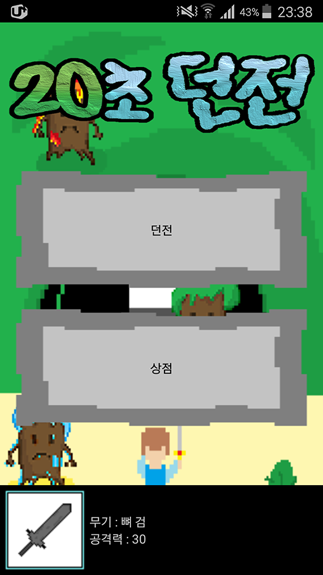 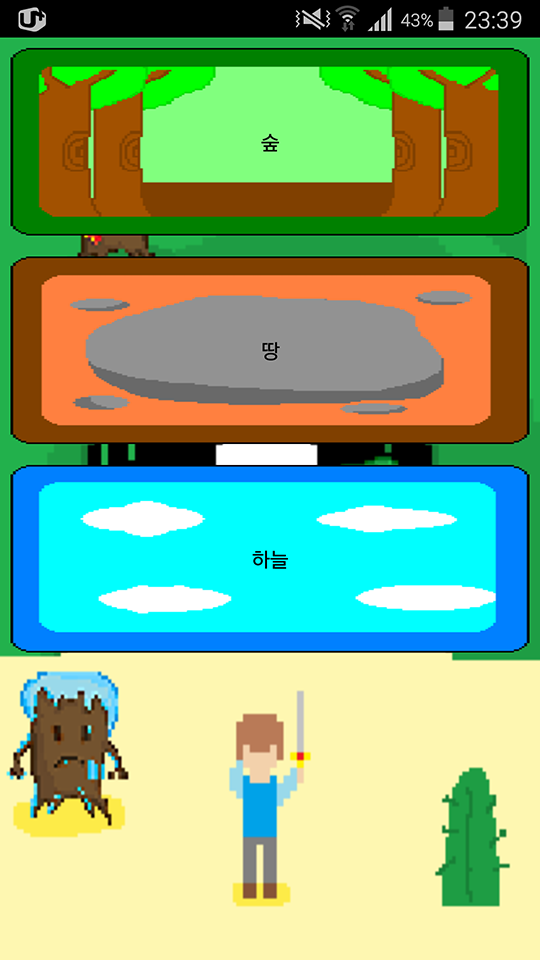 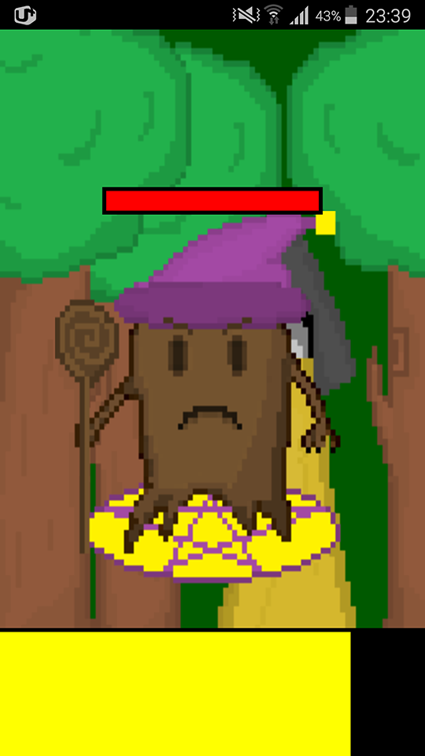 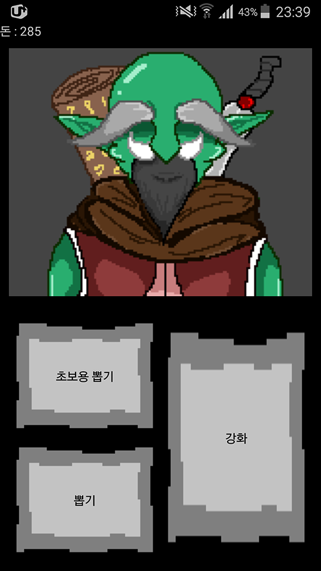 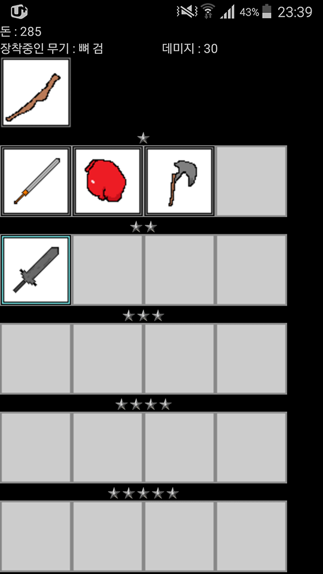

팀 프로젝트
===========
### 세대 차이
#### 가족사이에서 일어나는 문제에 대한 자신의 입장에서의 의견과 세대차이를 이해하기위해 많은 컨텐츠를 제공하는 앱
- 제작 기간 : 2016/05/27 ~ 2016/05/28
- 사용 기술 : ButterKnife, Retrofit, Gson, Jericho, Glide JSP, MYSQL, JSON, Support Library
- 내용 : 고등학교 교내 해커톤 대회에서 2등 수상 앱

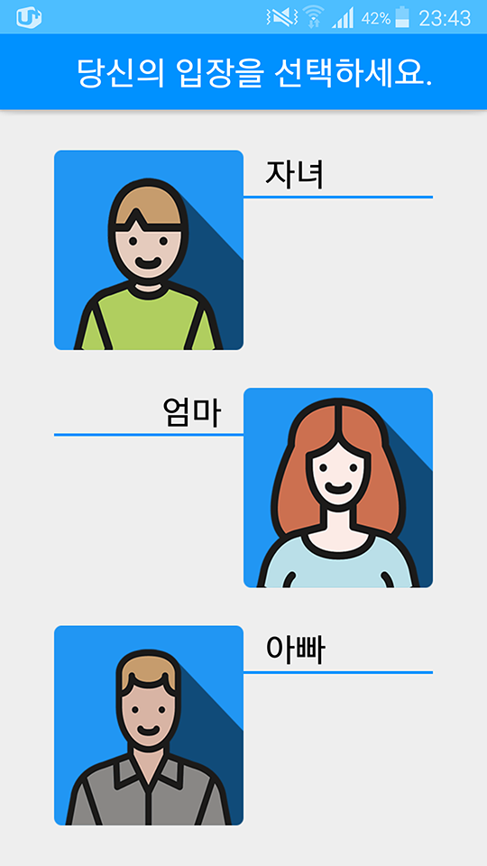 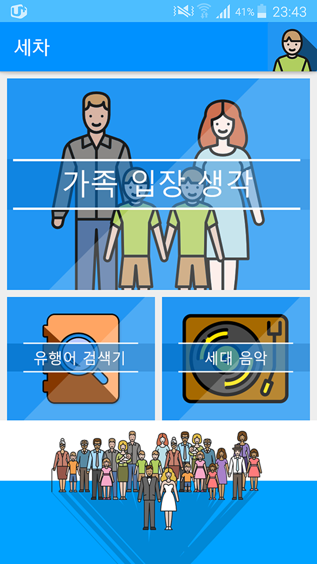 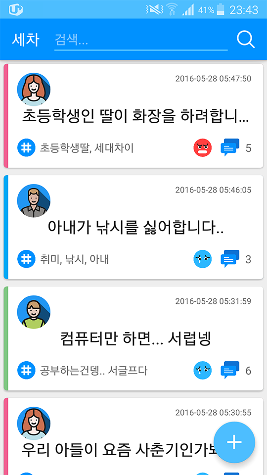 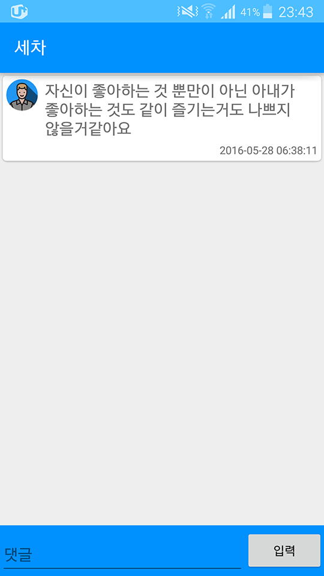

### 화남금녀
#### 남녀의 입장에서 발생하는 문제들과 고민들을 익명SNS을 통해서 해결하는 앱
- 제작 기간 : 2016/03/26 ~ 2016/03/27
- 사용 기술 : Retrofit, ButterKnife, GSON, PHP, MYSQL, JSON
- 내용 : SK Plannet에서 개최하는 STAC대회에서 발표상을 수상 앱

 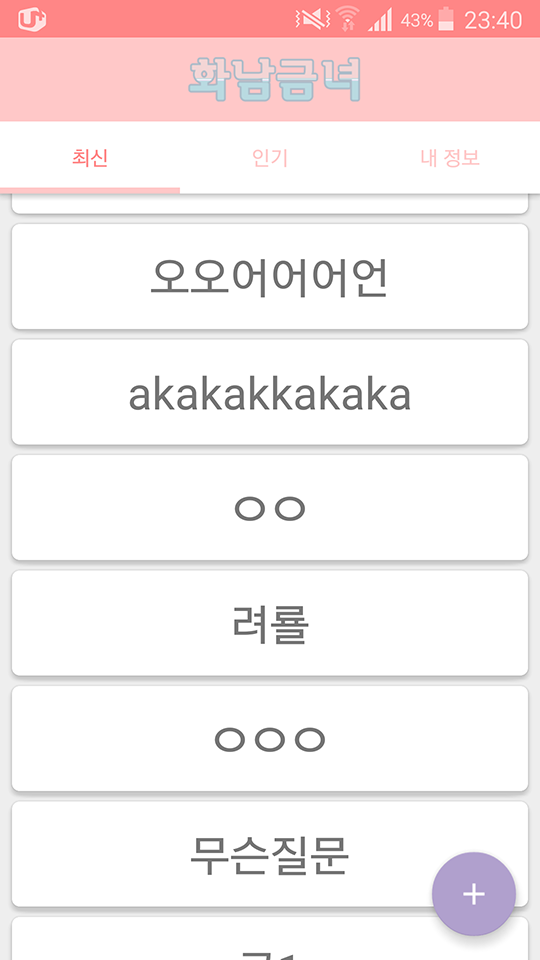 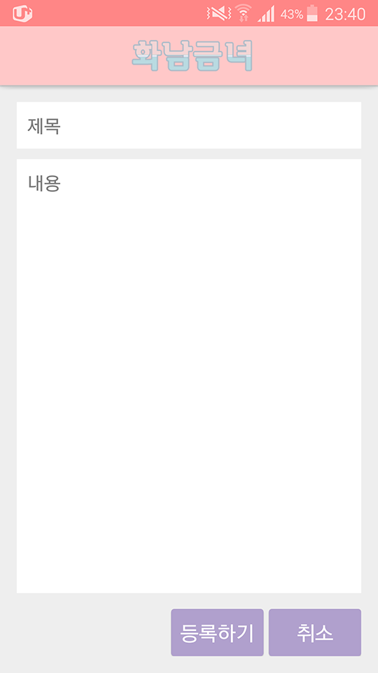 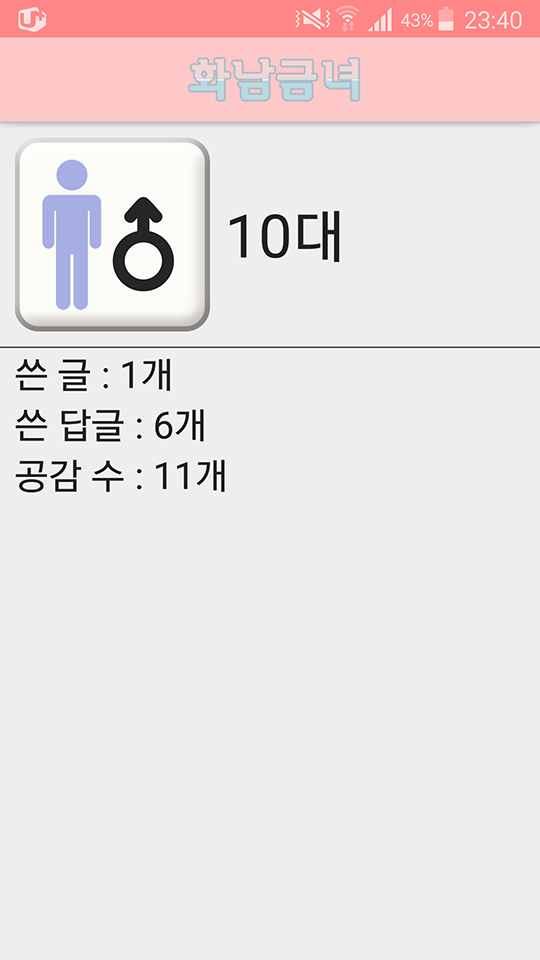
