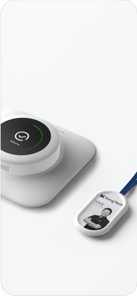

프로필
============
## 김동혁 / DongHyuk Kim
#### Email&ensp;&ensp;&ensp;&ensp;&ensp;sss989870@gmail.com
#### Blog &ensp;&ensp;&ensp;&ensp;&ensp;https://dongkyprogramming.tistory.com/
#### Skills &ensp;&ensp;&ensp;&ensp;&ensp;iOS, Swift, Android
#### Age  &ensp;&ensp;&ensp;&ensp;&ensp;&ensp;22

  

경력 사항
============
## 콩테크 주식회사 (https://kong-tech.com)
### - iOS Developer (소프트웨어 사업부)  
### - 2016년 11월 ~ 재직중 (병역특례 산업기능요원)  
 

### 콩체크 (https://check.kong-tech.com)
#### 비콘 기술을 이용한 출입 통제 및 구분으로 근무시간 측정과 다양한 근무 데이터들을 제공하는 서비스
- Preview  
    

#### 콩체크 프로젝트 시작부터 기획, 설계에 참여하였고, iOS 기능 개발 / 유지 보수를 혼자 담당했습니다. 
#### 앱의 규모가 커질수록 코드 유지보수성 / 재사용성에 많이 신경을 썼으며, 특히 블루투스와 네트워크 통신들의 안정성에 신경을 썼습니다. 
### 사용
- Swift, RxSwift, RxCocoa
- Moya 
- Clean Architecture
- Google Login, Kakao Login
- Google Maps, Firebase Crashlytics
 

### Plutocon (https://www.kong-tech.com/beacon/plutocon)
#### No Message
- Preview  
    

### 사용
- Swift, RxSwift, RxCocoa
- Moya 
- VIPER
- Google Login, Kakao Login
- GoogleMaps, GooglePlaces, Firebase Crashlytics
 

개인 프로젝트
============

### GetamInfo
#### Getamped라는 PC게임의 정보를 모바일에 담은 앱
- 제작 기간 : 2016/04/21 ~ 2016/05/18
- 사용 기술 : Jericho, Glide, ButterKnife, Support Library
- [Google Play](https://play.google.com/store/apps/details?id=com.mycompany.getam) 
   

#### 어렸을 때 좋아하던 게임의 정보를 보여주는 앱으로, 제가 코딩에 관심을 가진 계기인 앱입니다.
#### 게임의 정보를 보여주기 위해서 게임 홈페이지에 있는 데이터들을 HTML로 파싱 후 이미지로 뿌리는 형태에 앱 입니다.

### Match Up
#### 모든 스포츠 경기의 진행을 돕고 경기를 방송, 중계 할 수 있는 앱
- 제작 기간 : 2016/08/01 ~ 2016/09/23
- 사용 기술 : Firebase, Realm, MySQL, PHP, ButterKnife, Retrofit, RTMP, Facebook API, JavaCV, OpenCV
- [Google Play](https://play.google.com/store/apps/details?id=com.stack_yy.matchup) 
   

#### 고등학생때, STAC이라는 대회 참여 때 만든 앱 입니다. 스포츠 중계를 하기위해서 점수판 형태로 실시간 경기들을 볼 수 있고,
#### OpenCV, RTMP와 Facebook Live API를 이용해 실제 영상 경기도 페이스북을 통해서 볼 수 있게 한 앱입니다.
